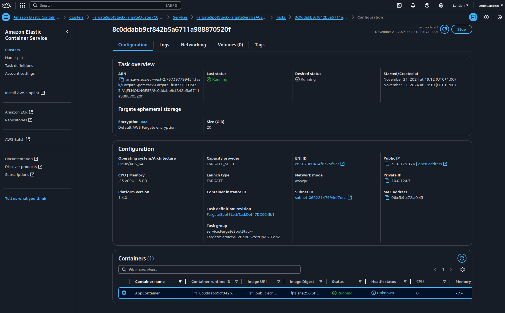
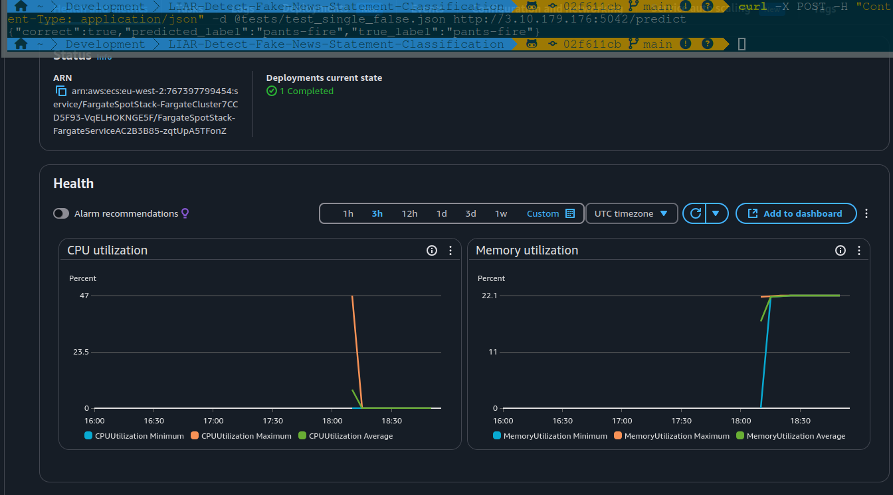

# CDK Subproject for ECS Fargate Deployment

This project sets up an AWS ECS Fargate service using AWS CDK (Cloud Development Kit). It demonstrates deploying a containerized application hosted in an Amazon ECR public repository.

---

## **Setup Instructions**

### **Install Dependencies**

1. Install `npm` on Arch Linux:

   ```bash
   yay -S npm
   ```

2. Install `TypeScript` and AWS CDK globally:

   ```bash
   sudo npm install -g typescript
   sudo npm install -g cdk
   ```

3. Install project dependencies:

   ```bash
   npm install
   ```

4. **Initialize the CDK App** (if starting from scratch):

   ```bash
   cdk init app --language typescript
   ```

5. **Run Tests**:
   Validate the stack configuration by running the Jest tests:

   ```bash
   npm test
   ```

6. **Synthesize the CloudFormation Template**:
   Generate the CloudFormation template for the stack:

   ```bash
   cdk synth
   ```

7. **Deploy the Stack**:
   Deploy the ECS service to AWS:

   ```bash
   cdk deploy
   ```

8. **Cleanup**:
   To avoid incurring costs, destroy the deployed service:

   ```bash
   cdk destroy
   ```

## **Project Structure**

```
cdk/
│
├── bin/
│   └── aws_ecs_deployment.ts  # CDK entry point; initializes and synthesizes the stack
│
├── lib/
│   └── aws_ecs_deployment-stack.ts  # Defines the AWS resources for the ECS Fargate service
│
├── test/
│   └── aws_ecs_deployment.test.ts  # Test file for validating the stack's configuration
│
├── package.json                 # Project dependencies
├── cdk.json                     # CDK project configuration
└── README.md                    # Project documentation
```

---

## **Key Files**

- **`bin/aws_ecs_deployment.ts`**:

  - Entry point for the CDK app.
  - Defines the application and initializes the `FargateSpotStack` stack.

- **`lib/aws_ecs_deployment-stack.ts`**:
  - Defines the infrastructure for the ECS Fargate service, including:
    - A VPC with a single availability zone.
    - An ECS cluster.
    - A Fargate service running a single spot instance for lowest costs.
    - Security group for public access.

---

## **Post-Deployment Verification**

1. After deployment, view the ECS task details in the AWS Management Console. The public IP of the running task is visible:
   

2. Test the public service using `curl`:

   ```bash
   curl -X POST -H "Content-Type: application/json" -d @tests/test_single_false.json http://<Public-IP>:5042/predict
   ```

   Replace `<Public-IP>` with the public IP of the ECS task.

3. Observe task activity in the AWS Console. Example screenshot:
   
